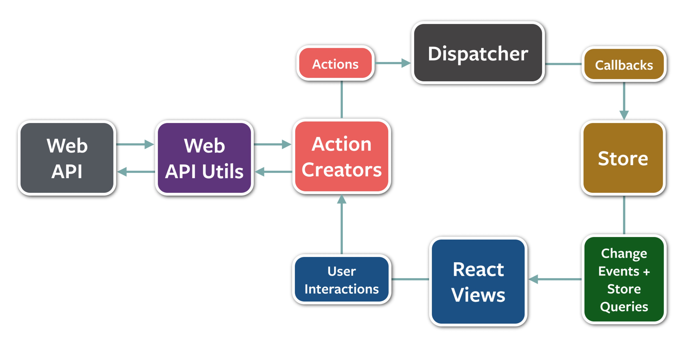

# Redux의 탄생

- 리액트는 **SPA**라고 부르는 **Single Page Application**을 개발하기 위한 라이브러리이다.
- SPA가 등장한 이후로 다양한 요구사항들을 적용하면서 웹사이트의 규모가 점점 커지게 되었다.
  - 관리해야 할 상태(`state`)들이 많아졌다 == 상태관리의 복잡도가 크게 증가
- 상태에는 서버로부터 받아와서 캐싱된 데이터뿐만 아니라, 로컬에서 사용하는 데이터들도 포함되어 있다.
  - 페이지에서 사용하는 UI 컴포넌트들의 상태들도 포함될 수 있다.
- 이처럼 웹사이트의 규모가 커지고 수많은 상태들을 관리하게 되면서, 개발자들은 어려운 문제들에 직면하게 된다.
  - 가장 대표적인 예로, **언제 어디서 어떻게 상태가 업데이트 되는지** 파악하기가 힘들어진다는 것
- 어떤 컴포넌트에서 언제, 어떻게, 왜 상태를 변경했는지 파악해야하는데,
- 개발자가 이 과정을 제대로 파악하지 못한다면, 버그의 원인을 찾고 수정하는데에도 시간이 오래 걸리게 된다.

> "수많은 상태들을 어떻게 효과적으로 관리할 것인가?"

이러한 문제를 해결하고 상태들을 명확하게 관리하기 위해서, **상태 관리만을 위한 기술**이 등장하게 되었고,

그렇게 등장한 것이 바로 **Redux이다.**

# Flux Architecture

- Redux의 기반이 되는 Flux Architecture에 대해서 먼저 알아보자.
- Flux 공식 GitHub repository에서 Flux를 다음과 같이 정의한다.
  - “An application architecture for React utilizing a unidirectional data flow.”
  - **단방향 데이터 흐름을 활용한 리액트용 애플리케이션 아키텍처**
  - 좀 더 쉽게 정의하자면, **데이터의 흐름을 정의한 하나의 방법**
- Flux Architecture의 구조를 나타낸 그림을 한 번 보자.



- 다양한 요소들이 나오는 것을 볼 수 있는데, Web과 관련된 Web API와 Web API Utils부분은 Flux와는 상관없는 부분이고, 실제로 Flux에서 정의하는 데이터의 흐름과 관련된 부분은 바로 오른쪽 부분이다.
  - Action, Dispatcher, Store 을 잘 보면, 화살표가 단방향으로 되어 있는 것을 볼 수 있다.
    - 화살표의 방향이 데이터가 흘러가는 방향이다.


- 그렇다면 이번에는 Flux에서 데이터의 흐름 부분만 나타낸 그림을 보자.
  1. Action : 데이터 흐름에 변화를 주기 위한 어떤 동작이 발생
  2. 발생한 Action을 Dispatcher가 수신한다.
  3. Dispatcher를 통해 변화된 데이터가 Store에 저장된다.
  4. 실제 사용자가 보게 되는 View에는 Store에서 가져온 데이터를 보여준다.
  5. View에서 또 다른 Action이 발생하게 되면, 이것 역시 동일한 흐름을 따라서 처리된다.


- 이렇게 단방향으로 데이터의 흐름을 정의한 것이 바로 Flux Architecture 이다.

> 💡 **Redux implements Flux**
>
> - Redux는 **Flux라는 Architecture를 실제로 구현한 구현체**이다.
> - 즉, Redux는 Flux라는 아키텍처를 곧바로 사용할 수 있게 구현한 라이브러리

# Three Principles of Redux

Redux에 대해서 제대로 이해하기 위해서는 이 Three Principles라고 불리는 **Redux의 세 가지 원칙**에 대해서 확실하게 이해하고 있어야 한다.

## **Single source of truth**

- 진실이라고 여겨지는 값은 여러곳이 아닌, 단 한 곳에만 존재해야 한다.
- Redux에서는 애플리케이션의 모든 상태들을 Redux Store라고 불리는 곳에 저장한다.
  - 그리고 이 Redux Store가 바로 Single source of truth가 된다.
- source of truth가 단 하나가 되면 생각보다 많은 문제들이 간단하게 해결된다.
  - 예를 들면 어떤 상태의 값이 내가 원하는대로 변경이 되는지 확인이 필요할 때, 이 Store 내부에서 해당 상태의 값이 어떻게 변하는지만 확인을 하면 된다.
  - 상태의 변화 조차도 한 줄로 직렬화시켜서 상태의 변화를 일목요연하게 살펴볼 수 있으며, 이전 값으로 되돌리거나 상태 변경을 하나씩 해보면서 디버깅도 쉽게 할 수 있다.

## **State is read-only**

- **상태 값은 읽기 전용**이어야 한다.
- 첫 번째 원칙에 따라 모든 상태의 값은 하나의 Source of truth에 저장됩니다.
- 그리고 여기서 필요한 상태의 값을 읽어서 사용하게 되는데, **상태값을 읽을 수만 있고 변경할 수는 없습니다.**
  - 만약 외부에서 이 상태값을 맘대로 변경할 수 있게 된다면, Single source of truth가 가지는 의미가 없게 되기 때문
- 그렇다면 어떻게 상태를 변경할 수 있을까?
  - 사전에 미리 정의해둔 어떤 상황이 발생했을 경우에 **사전에 정해진대로만** 상태를 변경할 수 있다.
- 이렇게 상태를 변경할 상황과 변경될 규칙을 사전에 정의해두면 상태를 직접 변경할 수 없을뿐만 아니라, 상태를 변경할 때마다 어떤 목적과 어떤 값으로 상태를 변경하는지 한 눈에 쉽게 파악할 수 있다.
  - 모든 상태의 변화가 단 한 곳. 즉, Single source of truth인 Redux Store에서 **정해진 상황과 규칙에 따라서 일어나기 때문**
  - 이러한 모든 상태의 변화는 `redux-devtools`를 사용해서 자세히 확인할 수 있다.

## **Changes are made with pure functions**

- **변화는 pure 함수들을 통해 이뤄져야 한다.**
- pure 함수란?
  - **입력값을 변경하지 않으며, 같은 입력값에 대해서는 항상 같은 출력값을 리턴하는 함수**

```jsx
// pure function
function sum(a, b) {
  return a + b;
}

// impure function
function withdraw(account, amount) {
  account.total -= amount;
}
```

- Redux 에서 상태의 변화를 일으키는 함수를 **Reducer**라고 부르는데, **모든 Reducer는 Pure function이어야 한다.**
  - Pure function처럼 작동한다는 것은, 입력으로 받은 이전 상태를 직접 변경하는 것이 아니라 새로운 상태 객체를 만들어서 리턴한다는 것이며,
  - 또한 같은 입력에 대해서는 항상 같은 결과를 리턴한다는 뜻이기도 하다.


- Redux를 사용하다보면 상태에 변화를 주어야 할 경우가 아주 많이 생기게 된다.
  - 그 말은 그만큼 많은 Reducer들을 만들어야 한다는 뜻입니다.
  - 그리고 이런 수많은 Reducer들이 항상 정해진대로 역할을 잘 수행하게 하기 위해서는, Pure function이 되어야 한다.

# Redux Data Flow

- 아래 그림은 [Redux 공식 문서](https://redux.js.org/tutorials/fundamentals/part-2-concepts-data-flow)에서 Redux의 데이터 흐름을 시각화하여 표현한 것이다.


**데이터의 흐름을 살펴보자.**

1. 먼저 사용자가 UI에서 Deposit 10$ 버튼을 누른다.
2. 그러면 클릭 이벤트가 이벤트 핸들러로 전달이 되고, Action이 만들어지고 Dispatch 된다.
3. Dispatch된 Action은 현재 State와 함께 Reducer로 전달이 되며,
4. Reducer에서는 변경된 새로운 State를 리턴한다.
5. 그리고 이렇게 변경된 새로운 State가 UI에 나타나게 된다.

# 꼭 Redux 이어야 할까?

## 다양한 상태관리 라이브러리

- MobX
  - Observable state라는 것을 만들어서 상태 관리를 하는 방식
  - 몇년 전에 비해서 요즘은 언급되는 비중이 조금 줄어드는 추세
- Recoil
  - 리액트를 만든 Meta에서 만든 라이브러리이며, 그만큼 리액트와 궁합이 잘 맞도록 개발되었다.
- Zustand
  - Zustand는 독일어로 ‘상태’라는 뜻
  - 리액트와 관련된 오픈소스 활동을 활발히 하고 있는 Poimandres라는 곳에서 개발한 라이브러리
  - Redux에 비해 사용하기 쉽고 심플하다는 장점이 있다.
- Jotai
  - Jotai는 일본어로 ‘상태’라는 뜻
  - Recoil과 유사하며 리액트에서 발생하는 추가적인 리렌더링 이슈를 해결하기 위해서 탄생

## 개발하려는 프로젝트에 맞게 선택하자!

- 다양한 상태관리 라이브러리의 npm trend를 확인해보면 (2024.1 기준)
  - 역사와 전통을 자랑하는 Redux가 압도적으로 상위권에 위치한 것을 볼 수 있으며,
  - 뒤를 이어 Zustand가 MobX를 따돌리고 빠르게 올라오는 것을 볼 수 있다.


- Redux가 처음에는 조금 복잡하게 느껴질 수 있지만, Redux를 먼저 학습하고 난 이후에 다른 상태 관리 라이브러리를 사용한다면 더 쉽게 이해하고 사용할 수 있을 것이다.
- 하지만 각각의 상태관리 라이브러리들이 탄생하게 된 이유와 목적이 모두 다르기 때문에 개발하려는 프로젝트에 맞게 선택해서 사용하는 것을 추천한다.
